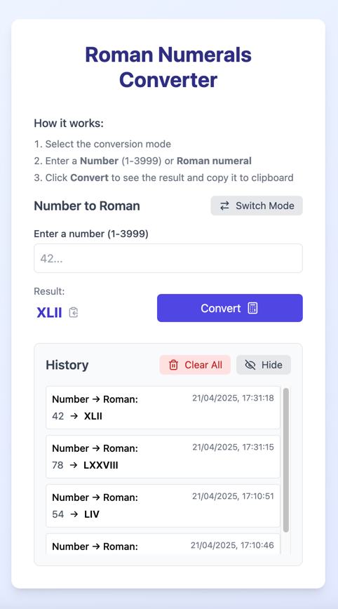
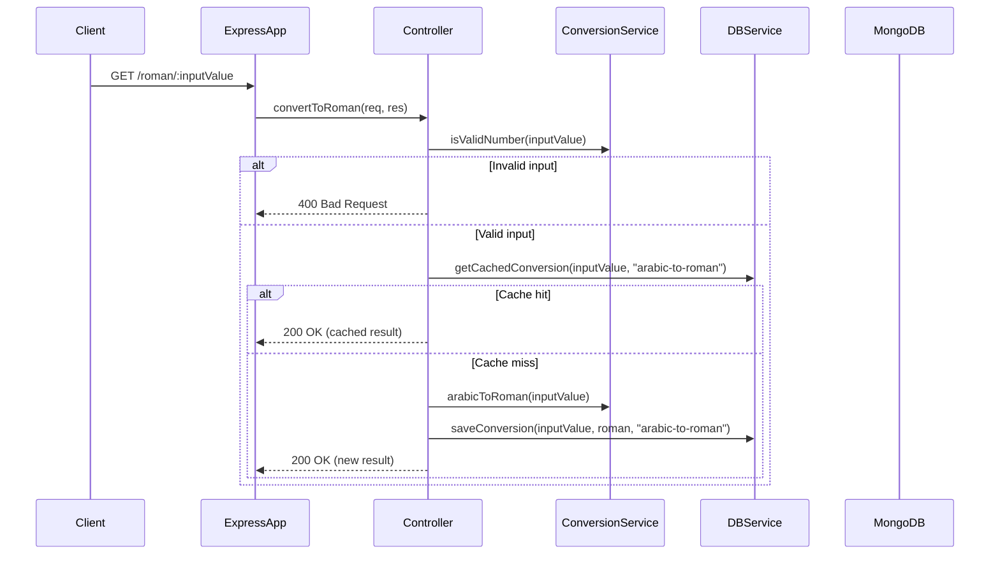
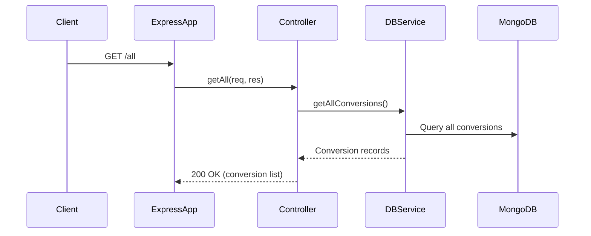

# Roman Numerals Converter

A full-stack application that converts between Roman numerals and Arabic numbers, with caching capabilities.

## Features

- Convert Arabic numbers to Roman numerals
- Convert Roman numerals to Arabic numbers
- Caching of previous conversions for faster response
- History of all conversions
- Ability to clear conversion history

## Tech Stack

- **Frontend**: React.js, Tailwind CSS
- **Backend**: Node.js with Express
- **Database**: MongoDB
- **Testing**: Jest with Supertest

## API Endpoints

- `GET /roman/:inputValue` - Convert Arabic number to Roman numeral
- `GET /arabic/:inputValue` - Convert Roman numeral to Arabic number
- `GET /all` - Get all previous conversions
- `DELETE /remove` - Clear all conversion history





## Installation

### Prerequisites

- Node.js (v14 or higher)
- npm or yarn
- MongoDB (local installation or MongoDB Atlas account)

### Backend Setup

1. Clone the repository:
   ```bash
   git clone https://github.com/NataliUstinova/roman-numerals-project.git
   cd roman-numerals-project
   ```

2. Install backend dependencies:
   ```bash
   cd backend
   npm install
   ```

3. Create a .env file in the backend directory with the following variables:
    #### For Linux/Mac
   ```bash
   # For Linux/Mac
   echo "PORT=8080
   MONGODB_URI=mongodb://localhost:27017/roman-numerals-db
   NODE_ENV=development
   LOG_LEVEL=info
   ALLOWED_ORIGINS=http://localhost:3000" > .env
   ```
  
    ##### For Windows (PowerShell)
    ```PowerShell
    New-Item -Path .env -Value "PORT=8080`nMONGODB_URI=mongodb://localhost:27017/roman-numerals-db`nNODE_ENV=development`nLOG_LEVEL=info`nALLOWED_ORIGINS=http://localhost:3000" -Force
    ```
4. Start the backend server:
   ```bash
   npm start
   ```

   For development with auto-reload:
   ```bash
   npm run dev
   ```

### Frontend Setup

1. Open a new terminal and navigate to the frontend directory:
   ```bash
   cd ../frontend
   ```

2. Install frontend dependencies:
   ```bash
   npm install
   ```

3. Start the frontend development server:
   ```bash
   npm start
   ```

4. The application should now be running at http://localhost:5173

### Testing

#### Backend Tests

Run the backend tests with:
```bash
cd backend
npm test
```

## Running with Docker

Build and start the containers:
```bash
docker-compose up --build
```

To run in detached mode:
```bash
docker-compose up -d
```

To stop the containers:
```bash
docker-compose down
```

## Accessing the Application

- Frontend: http://localhost:5173
- Backend: http://localhost:8080
- MongoDB: mongodb://localhost:27017

## Development with Docker

For development with hot-reloading:
```bash
docker-compose -f docker-compose.dev.yml up --build
```

## Environment Variables

Create a .env file in the project root with the following variables:
```bash
MONGODB_URI=mongodb://mongo:27017/roman-numerals-db
NODE_ENV=development
LOG_LEVEL=info
ALLOWED_ORIGINS=http://localhost:5173
```

## Useful Docker Commands

View logs:
```bash
docker-compose logs -f
```

Rebuild specific service:
```bash
docker-compose up --build <service_name>
```

Access MongoDB shell:
```bash
docker exec -it roman-numerals-mongo mongo
```
