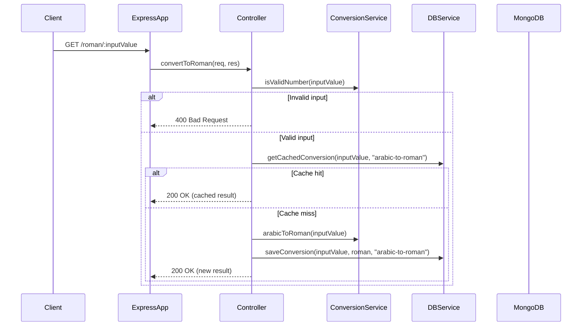
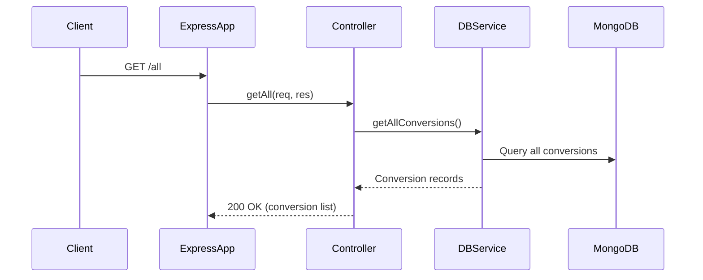

## API Endpoints

- `GET /roman/:inputValue` - Convert Arabic number to Roman numeral
- `GET /arabic/:inputValue` - Convert Roman numeral to Arabic number
- `GET /all` - Get all previous conversions
- `DELETE /remove` - Clear all conversion history

